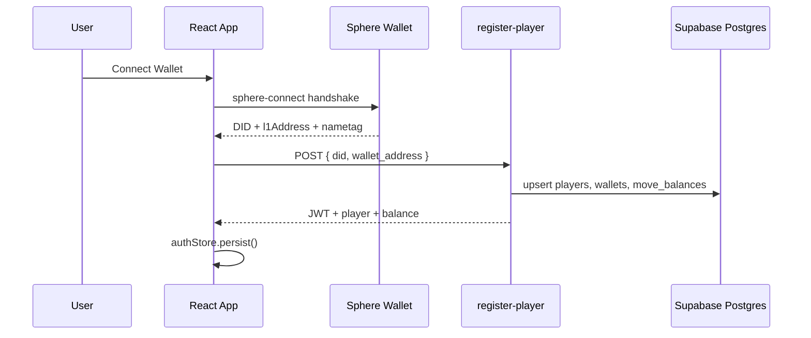
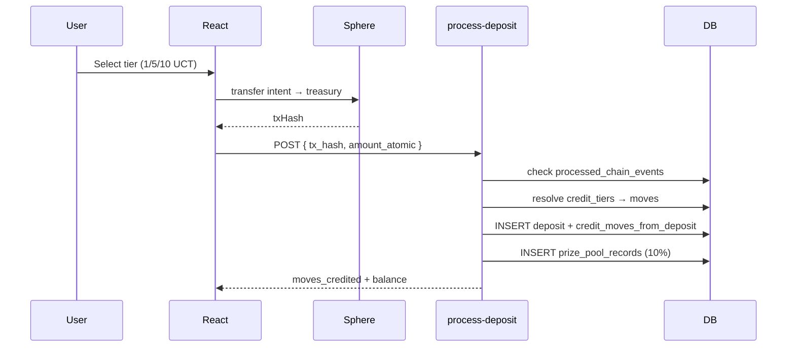

# Sphere 2048 v2 — Production Architecture

Web3 2048 on Unicity Sphere SDK with Supabase backend, React frontend, and server-authoritative game economy.

## Folder Structure

```
sphere-2048/
├── apps/
│   ├── web/                          # React + Vite + TypeScript + Tailwind
│   │   ├── src/
│   │   │   ├── components/           # Preserved UI (board, scores, leaderboard)
│   │   │   ├── pages/                # Landing, Connect, Deposit, Game, Leaderboard, Profile, Weekly Pool
│   │   │   ├── hooks/                # useSphereWallet, useSwipe
│   │   │   ├── stores/               # Zustand: authStore, gameStore
│   │   │   └── lib/                  # api.ts, supabase.ts (realtime)
│   │   └── package.json
│   └── treasury-worker/              # Node cron: settle week → pay top 5 → Sphere DMs
├── packages/
│   ├── game/                         # Pure 2048 engine (ported from game.js)
│   └── shared/                       # Types, economy math, API contracts
├── supabase/
│   ├── migrations/                   # Postgres schema + RLS + seed tiers
│   ├── functions/                    # Edge Functions (Deno)
│   │   ├── register-player/
│   │   ├── start-game/
│   │   ├── execute-move/             # Score validation + credit deduction
│   │   ├── end-game/                 # Move-sequence replay validation
│   │   ├── process-deposit/          # Idempotent tx_hash processing
│   │   ├── get-leaderboard/
│   │   ├── get-weekly-pool/
│   │   └── settle-weekly-round/      # Cron: payouts + new round
│   └── config.toml
├── public/                           # Legacy v1 (preserved during migration)
└── docs/ARCHITECTURE_V2.md
```

## Database Schema (Postgres)

| Table | Purpose |
|-------|---------|
| `players` | DID + display name |
| `wallets` | L1 addresses linked to player |
| `credit_tiers` | Configurable deposit → moves (1→50, 5→300, 10→700) |
| `move_balances` | **Source of truth** for remaining credits |
| `deposits` | tx_hash, amount, moves credited, status |
| `game_sessions` | Auditable sessions with board_state + server_seed |
| `session_moves` | Per-move audit trail for score validation |
| `leaderboard_entries` | Global + weekly entries |
| `weekly_rounds` | Round boundaries + prize pool total |
| `prize_pool_records` | Per-deposit pool contributions |
| `payout_records` | Settlement output (pending → sent) |
| `processed_chain_events` | Duplicate deposit protection |
| `auth_nonces` | Wallet signature replay protection |

### Key constraints
- `deposits.tx_hash` UNIQUE — no double-credit
- `deduct_move_credit()` — atomic credit decrement with row lock
- `credit_moves_from_deposit()` — atomic credit grant
- RLS: players read own data; writes only via service role (Edge Functions)

## Authentication Flow



**No email/password.** JWT claims: `player_id`, `did`, `wallet_address`.

## Deposit Flow



## Game Session Flow

```mermaid
sequenceDiagram
  participant React
  participant Start as start-game
  participant Move as execute-move
  participant End as end-game
  participant DB

  React->>Start: POST (JWT)
  Start->>DB: verify credits > 0
  Start->>DB: INSERT game_sessions (server_seed, board)
  Start-->>React: session

  loop Each move
    React->>Move: POST { session_id, direction }
    Move->>DB: applyMove server-side
    Move->>DB: deduct_move_credit (only if moved)
    Move->>DB: INSERT session_moves
    Move-->>React: updated board + balance
  end

  React->>End: POST { session_id }
  End->>DB: replay move sequence vs server_seed
  End->>DB: validate score → leaderboard_entries
```

## Security Model

| Threat | Mitigation |
|--------|------------|
| Fake score submission | Server replays `session_moves` with `server_seed`; rejects mismatch |
| Fake move balance | `move_balances` only mutated by RPC in Edge Functions |
| Replay deposit | `processed_chain_events.tx_hash` UNIQUE + `deposits.tx_hash` UNIQUE |
| Replay moves | `session_moves (session_id, move_number)` UNIQUE |
| Client-side credit trust | Frontend displays balance from API only; never decrements locally |
| Direct DB writes | RLS denies client INSERT on balances, deposits, sessions, leaderboard |

## State Management (Frontend)

```
authStore (Zustand + persist)
  ├── accessToken
  ├── player, wallet
  └── moveBalance ← always refreshed from API responses

gameStore (Zustand, ephemeral)
  └── session ← board_state from server only

React Query
  ├── leaderboard (15s stale, realtime invalidation)
  └── weekly pool
```

## API / Edge Function Map

| Function | Auth | Responsibility |
|----------|------|----------------|
| `register-player` | Public | Upsert player, issue JWT |
| `start-game` | JWT | Create session if credits > 0 |
| `execute-move` | JWT | Validate + deduct + persist move |
| `end-game` | JWT | Replay-validate score, write leaderboard |
| `process-deposit` | JWT | Idempotent deposit credit |
| `get-leaderboard` | Public | Global / weekly query |
| `get-weekly-pool` | Public | Pool stats + top weekly |
| `settle-weekly-round` | Cron secret | Payout records + new round |

## Weekly Prize Pool

1. Each confirmed deposit contributes **50%** to `prize_pool_records`
2. `weekly_rounds.prize_pool_atomic` accumulates total
3. **Treasury worker** (`apps/treasury-worker`) — single hourly cron:
   1. Settle expired round → top **5** unique scorers → `payout_records` at **35% / 25% / 20% / 15% / 5%**
   2. Open next weekly round
   3. Auto-send UCT from treasury Sphere wallet (`payments.send`)
   4. Sphere DM congrats (`communications.sendDM`) after successful pay
4. Status flow: `pending` → `sent` (+ `tx_hash`, `sent_at`) → `dm_sent_at` set  
   Failures: `failed` + `failure_reason`, retried up to `MAX_PAY_ATTEMPTS`
5. Edge `settle-weekly-round` remains for manual/admin settle (creates `pending` only; no pay/DM)


## Realtime Leaderboard

Supabase Realtime on `leaderboard_entries` INSERT filtered by `period_type`. Frontend `subscribeLeaderboard()` prepends new entries.

## Migration from v1

| v1 (Express + SQLite/Redis) | v2 (Supabase) |
|-----------------------------|---------------|
| `game.js` | `packages/game` |
| `public/ui.js` wallet handshake | `useSphereWallet` hook |
| `public/index.html` styles | Tailwind theme tokens in `index.css` |
| `index.js` sessions Map | `game_sessions` table |
| `userBalances.js` | `move_balances` + `credit_tiers` |
| `db.getLeaderboard` | `leaderboard_entries` + Edge Function |

Legacy `public/` and `index.js` remain until v2 is deployed and data migrated.

## Deployment

```bash
# 1. Supabase
supabase link --project-ref <ref>
supabase db push
supabase functions deploy

# 2. Frontend (Vercel/Netlify)
cd apps/web && npm install && npm run build

# 3. Cron (weekly settlement + auto-pay + DMs) — free via GitHub Actions
# See .github/workflows/weekly-payout.yml (hourly schedule + manual run).
# Or: cd apps/treasury-worker && npm run settle-and-pay  (Task Scheduler / crontab)
```


## Environment Variables

| Variable | Where | Purpose |
|----------|-------|---------|
| `SUPABASE_URL` | Edge Functions | DB client |
| `SUPABASE_SERVICE_ROLE_KEY` | Edge Functions | Bypass RLS |
| `JWT_SECRET` | Edge Functions | Player JWT signing |
| `FRONTEND_URL` | Edge Functions | CORS |
| `CRON_SECRET` | settle-weekly-round | Cron auth (Edge fallback) |
| `VITE_SUPABASE_*` | React | Client + realtime |
| `VITE_GAME_TREASURY_NAMETAG` | React | Deposit destination |
| `TREASURY_MNEMONIC` | treasury-worker | Server Sphere wallet for auto-pay |
| `SUPABASE_SERVICE_ROLE_KEY` | treasury-worker | Settle + update payouts |